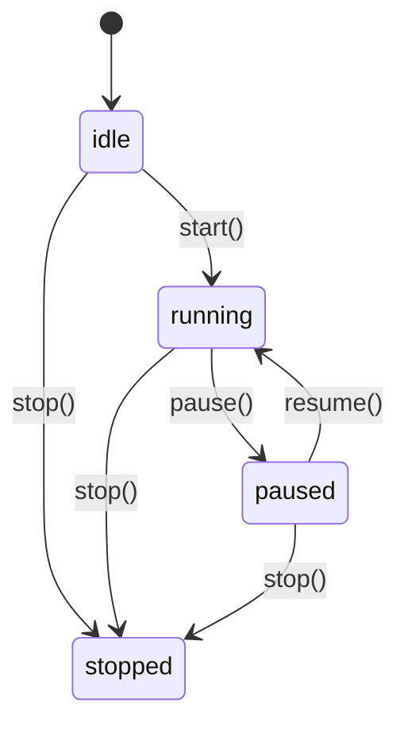
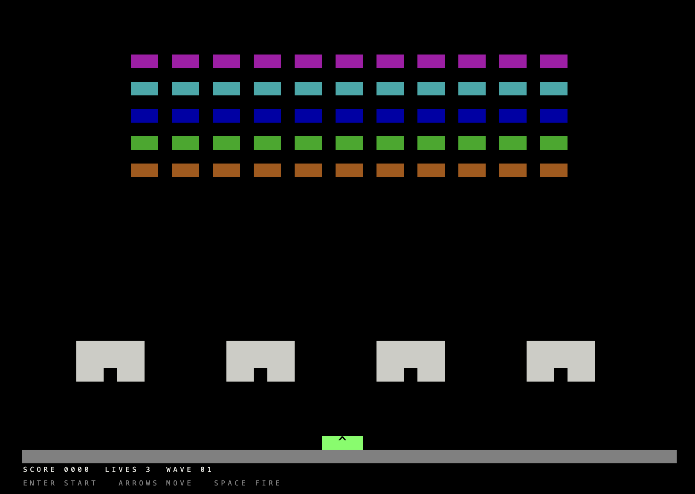
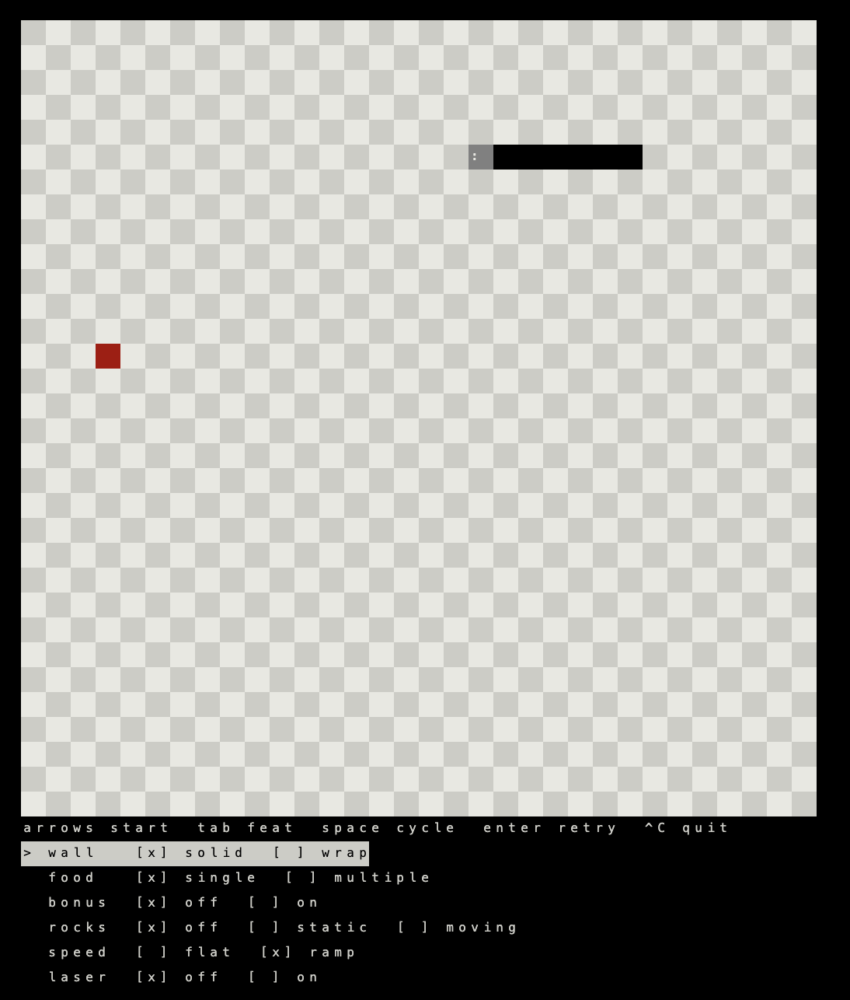
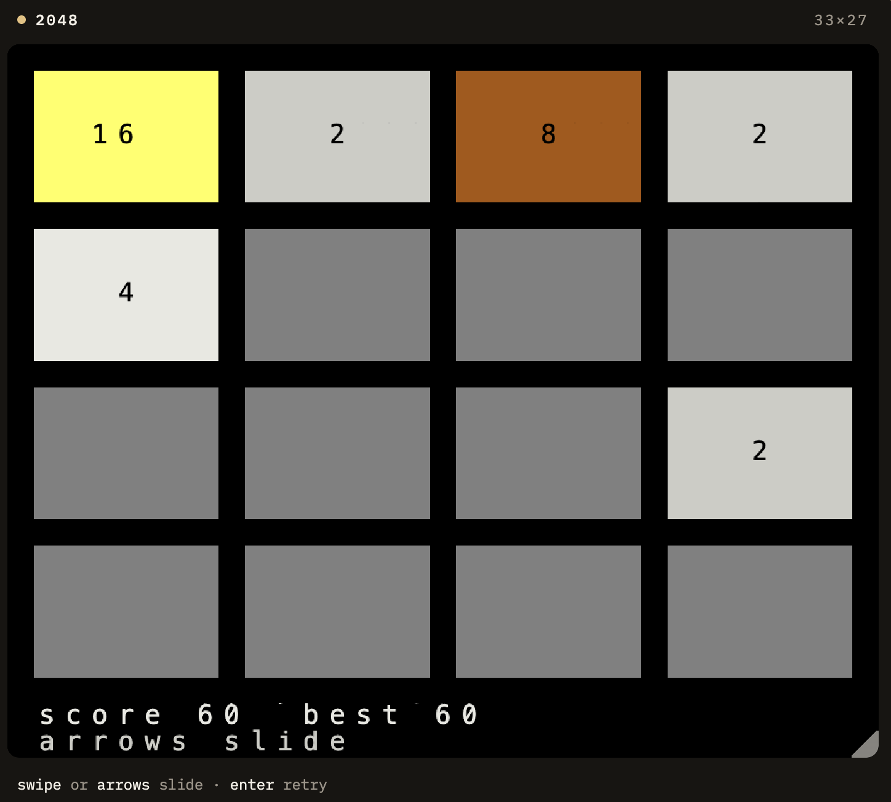
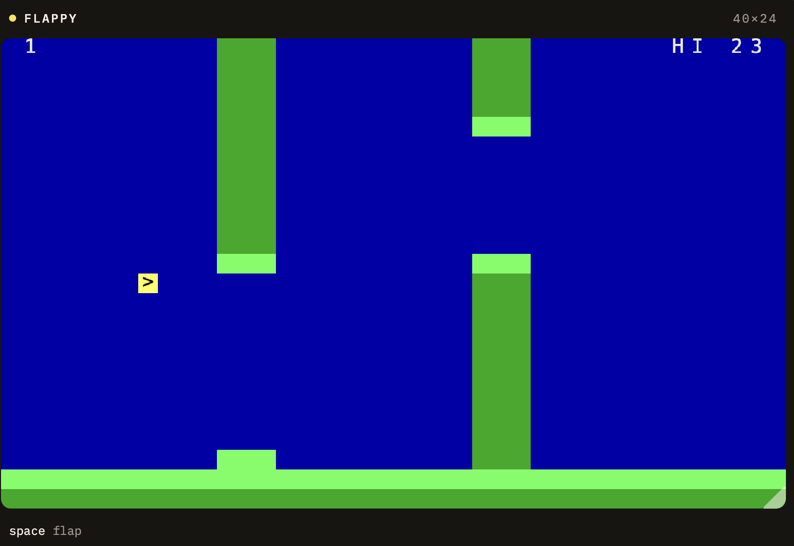

# TinyCell

A TypeScript engine for games made of cells. `tick` updates the grid, `view` draws it. One `App` runs on a canvas and in a terminal.

The slogan is the whole design: a **host-blind fixed-timestep cell engine**. One `App` owns the rules and the grid. The host only paints, feeds keys, and stores bytes. [`src/engine.ts`](src/engine.ts) imports nothing from Node, the DOM, or a canvas. Terminal and browser are adapters. A native port would be the same job: rewrite the adapters, keep the `App`.

## Why a grid

Most small engines grow a scene: sprites, a draw list, a camera, then a different renderer for every platform. TinyCell refuses that. If it is not a cell, it is not on screen. Snake, Invaders, 2048, Flappy, and Mario are all the same kind of object: a rectangle of packed cells, rewritten every tick.

That constraint is the point. A game written this way has nowhere to hide a `document` call or a `stdout` write. Logic and picture share a clock, and neither knows whether the next paint is ANSI or a `<canvas>`. Swap the painter and the same rules run somewhere else.

Time is discrete on purpose. The engine steps at `tickHz`. If the tab was asleep, missed time is caught up, then capped, so a wake cannot turn into a hundred ticks. Paint happens after the ticks, never between them. Input is drained at the end of each tick: one queue, one consumer.

## What a frame is

Something in the host — a key, a swipe — becomes an event and waits in a small ring. On the tick, the `App` reads that queue and changes its own state. Then `view` writes a `Surface`. The painter diffs that surface against the last one and sends only the dirty cells to the terminal or the canvas.

```
keys, swipes  →  queue  →  App.tick
                                │
                           App.view(Surface)
                                │
                           Painter.paint
```

`createEngine` is the wire between those three. You hand it an `App`, a `Painter`, and any number of input sources. It owns the clock: `start`, `pause`, `resume`, `stop`. Pause freezes time without dropping the adapters. Stop detaches input and disposes the painter. The grid is the smaller of what the game wants and what the host can show. A resize from either side rebuilds the surface.

2048 is a nice proof of the input side. On the web it listens to both the keyboard and a swipe. A drag becomes the same arrow event the terminal already produces. The game calls `keyOf`. It never sees a DOM event or a byte from stdin.

## A cell and a color

A cell is one `u32`: attributes, background, foreground, and a character.

```
[attrs:8][bg:4][fg:4][char:16]
```

`Color.White` is a name, not an RGB triple. Painters map that slot to ANSI, 256-color, truecolor, or canvas pixels. Pinning a slot to a specific RGB lives in the painter, so Ghostty and Chrome can disagree and the game stays the same.

The picture can still move. Flappy stores a fractional bird and scrolling pipes; 2048 slides tiles over several ticks. Both round onto cells before `view`. The screen never learns about the fractions.

## API

All of this lives in [`src/engine.ts`](src/engine.ts). A game implements `App`. A host implements `Painter` and any number of `InputSource`s. `createEngine` is the clock that ties them together.

### createEngine

```ts
function createEngine(opts: {
  app: App;
  painter: Painter;
  inputs?: InputSource[];
  tickHz?: number; // default 20, must be > 0
  maxTicksPerWake?: number; // default 4, at least 1
  resume?: Uint8Array;
}): Engine;
```

`inputs` attach as soon as the engine exists, before `start`. `tickHz` becomes a step of `max(1, round(1000 / hz))` milliseconds. Each wake spends the elapsed time in steps of that size, and stops after `maxTicksPerWake` ticks. Time past that cap is dropped. `resume` is an earlier `snapshot()` blob. How that brings a game back is in [Snapshot](#snapshot).

The grid is `min(app.size, painter.size)`. A non-positive side counts as zero, so either side can force an empty surface. It is built at creation, and again whenever the painter reports a resize. A change allocates a new `Surface`, fills it with `EMPTY_CELL`, calls `painter.resize`, then `app.onResize`.

```ts
interface Engine {
  start(): void;
  pause(): void;
  resume(): void;
  stop(): void;
  snapshot(): Uint8Array;
  readonly tick: number;
  readonly running: boolean;
}
```



On a wake the engine calls `app.tick`, then clears the queue, once per step that fits. When at least one tick ran, the phase is still `running`, and `painter.ready` is true, it calls `app.view` and `painter.paint`. Ticks keep running while the painter is not ready.

### App

```ts
interface App {
  tick(input: InputQueue, engine: Engine): void;
  view(out: Surface): void;
  readonly size: { readonly w: number; readonly h: number };
  onResize?(w: number, h: number): void;
  snapshot(out: Uint8Array): number;
  hydrate(blob: Uint8Array, offset: number, length: number): void;
}
```

`tick` reads the queue and mutates game state. `view` writes cells into the surface the engine owns. `size` is the grid the game wants. The painter may be smaller, and the engine uses the smaller of the two. `snapshot` and `hydrate` are the save path.

### Snapshot

`pause` holds a clock that is still in memory. A snapshot is how the same game is there after the tab closes or the process exits.

The host calls `engine.snapshot()` on the way out. In the browser that is hide and `pagehide`. In the terminal it is `stop`. The host stores the bytes. `localStorage` and a file under `~/.tinycell/` are both enough. The engine never sees the storage.

The next launch passes those bytes as `createEngine({ resume })`. Before the first wake the engine reads the header, restores `tick`, and calls `app.hydrate`. The first `view` already shows the saved board, and the clock continues from the saved tick. A wrong version or a short blob throws, so the host can construct a fresh engine and start over.

The blob is a 9-byte header plus the game's payload: version `1`, the tick as a little-endian `u32`, the payload length as a little-endian `u32`, then the bytes `App.snapshot` wrote. Call it from the host, between wakes.

`App.snapshot` writes that payload into `out` and returns its length. When `out` is too short, write nothing and return the length needed. The engine may call it twice, the first time to learn the size. `hydrate` reads `length` bytes from `blob` at `offset`. That range is the payload. The header stays in the engine. Board, score, seed: the game picks the layout. The same bytes resume on a canvas and in a terminal.

### Painter

```ts
interface Painter {
  readonly ready: boolean;
  readonly size: { readonly w: number; readonly h: number };
  onResize(cb: (w: number, h: number) => void): void;
  resize(w: number, h: number): void;
  paint(front: Surface): void;
  dispose(): void;
}
```

`paint` receives the whole front surface. Diffing belongs to the painter. `onResize` is how the painter tells the engine its size changed. `resize` is the engine telling the painter which grid to draw. `dispose` runs from `stop`.

### Cells

```ts
function packCell(ch: number, fg?: Color, bg?: Color, attrs?: Attr): Cell;
function cellChar(cell: Cell): number;
function cellFg(cell: Cell): number;
function cellBg(cell: Cell): number;
function cellAttrs(cell: Cell): number;
```

`Cell` is a `number` holding the `u32` from the layout above. `EMPTY_CELL` is a space. `Color` runs `Default`, `Black`, `Red`, `Green`, `Yellow`, `Blue`, `Magenta`, `Cyan`, `White`, then the same names with a `Bright` prefix. `Attr` is a flag in the low nibble: `Bold`, `Dim`, `Underline`, `Inverse`. Combine flags with `|`.

```ts
class Surface {
  readonly w: number;
  readonly h: number;
  readonly cells: Uint32Array;
  set(x: number, y: number, cell: Cell): void;
  fill(cell: Cell): void;
  writeText(x: number, y: number, s: string, fg?: Color, bg?: Color): void;
}
```

`set` ignores a point outside the grid. `writeText` writes one cell per code unit, clips at the edges, and leaves attributes clear.

### Input

```ts
class InputQueue {
  push(ev: number): void;
  readonly length: number;
  at(i: number): number;
  clear(): void;
}

interface InputSource {
  attach(queue: InputQueue): () => void;
}
```

The queue holds 64 events. A push past that drops the oldest. `at` returns `0` past the end. The engine clears the queue after every tick. `attach` starts pushing into that queue and returns the function `stop` will call.

An event is `[kind:8][code:24]`. `keyEvent(key)` and `charEvent(codepoint)` pack one. `keyOf` returns the `Key` for a key event and `0` for anything else, including a character. `Key` is `Up`, `Down`, `Left`, `Right`, `Enter`, `Escape`, `Space`, `Tab`, `Backspace`, `CtrlC`. A game walks `input` with `keyOf` and never sees the host that pushed the event.

## Demo Games

The same games are running at [farskid.github.io/tinycell](https://farskid.github.io/tinycell/). Each demo page is the live game next to the `App` and both hosts, so you can read the rules and play them.

[](https://farskid.github.io/tinycell/demos/invaders/)

[Invaders](https://farskid.github.io/tinycell/demos/invaders/). Enter starts, arrows move, space fires. Aliens, bunkers, and the ship are cells on a 48×34 grid.

[](https://farskid.github.io/tinycell/demos/snake/)

[Snake](https://farskid.github.io/tinycell/demos/snake/). Arrows start. The menu under the board is cells too: walls, food, rocks, speed, a laser. Those are rule switches inside the game, not engine features.

[](https://farskid.github.io/tinycell/demos/2048/)

[2048](https://farskid.github.io/tinycell/demos/2048/). Arrows or a swipe slide the tiles. Enter retries.

[](https://farskid.github.io/tinycell/demos/flappy/)

[Flappy](https://farskid.github.io/tinycell/demos/flappy/). Space flaps. One bird and scrolling columns, still drawn as cells.

[](https://farskid.github.io/tinycell/demos/mario/)

[Mario](https://farskid.github.io/tinycell/demos/mario/). Arrows run, space hops. The hop is a fixed arc of cells. A pit, a brick, a pipe, one goomba, a flag.
